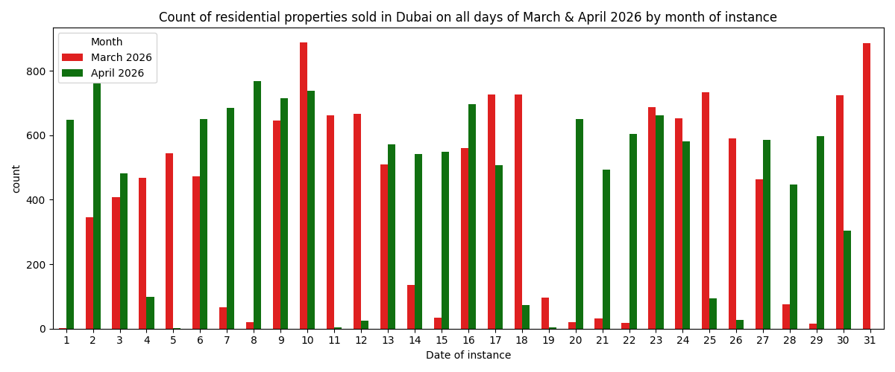
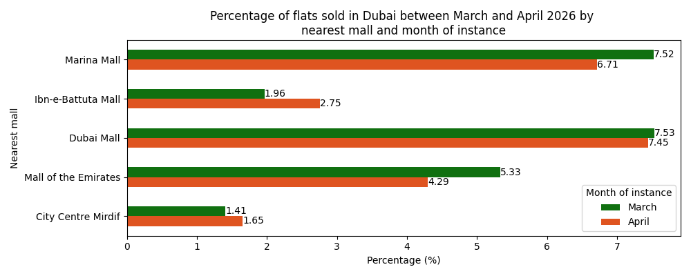
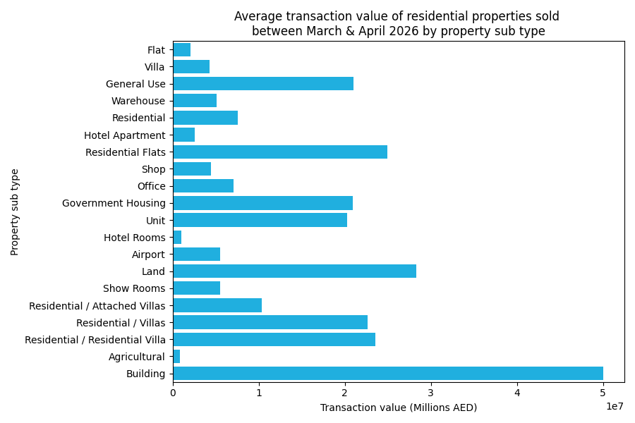
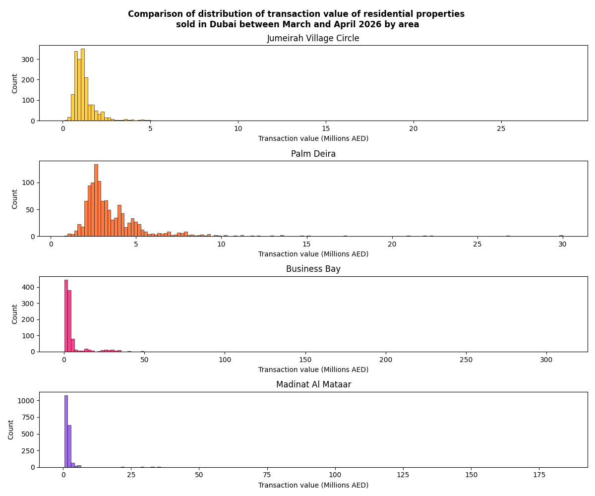
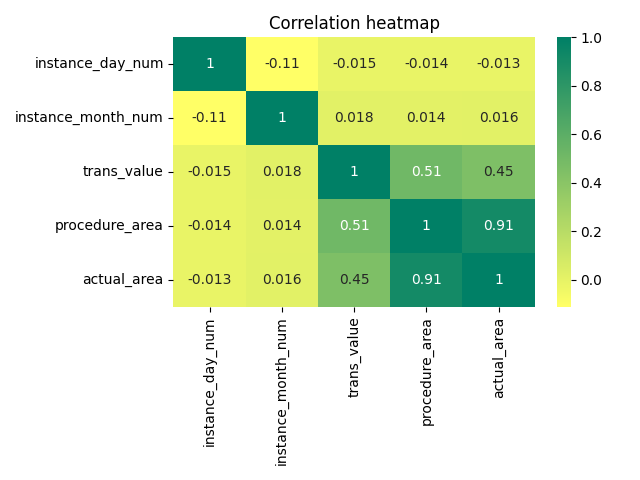
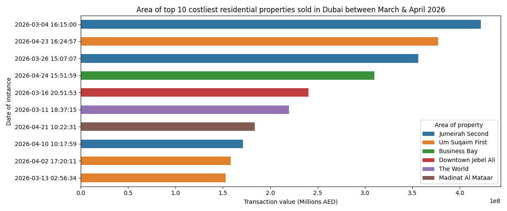
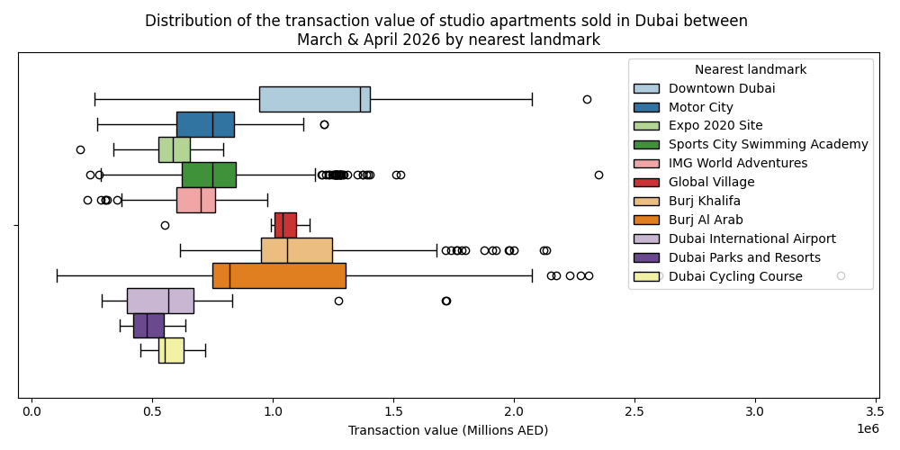
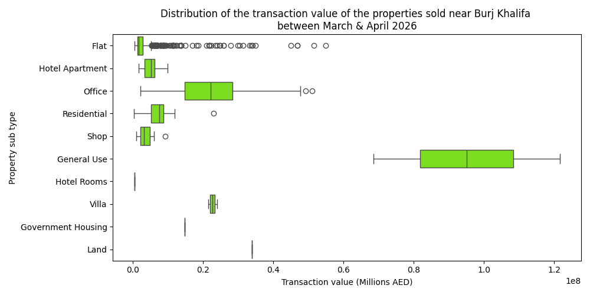
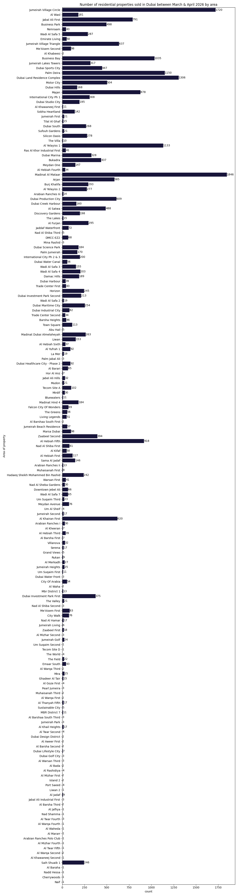
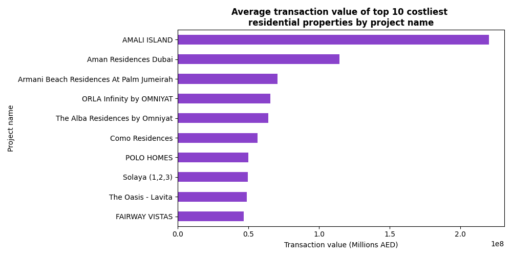

# Data Analysis of Dubai Real Estate Sales March to April 2026 🇦🇪
This project analyzes the distribution of transaction value of real estate properties sold in Dubai between March and April 2026. The dataset is downloaded from the open data provided by the Dubai Land Department website, and Dubai Pulse on 1st May 2026. This project preprocess and cleans the dataset for standardization, performs exploratory data analysis, creates visualizations on the cleaned dataset to draw insights about the top 10 costliest properties sold in Dubai in March & April 2026, find the different sub type of properties sold in Dubai by area, nearest mall, landmarks, and nearest metro stations, finds the sales trends before and after the festive season, customer buying pattern based on number of properties sold and more.

  
  
  
  
  

## Dataset
- Source: Dubai Land Department, Dubai Pulse
- Source url: https://dubailand.gov.ae/en/open-data/real-estate-data/#/
- Dataset url: https://www.kaggle.com/datasets/reshmaharidhas/dubai-real-estate-sales-march-to-april-2026
- Size: 26437 rows

## Kaggle Notebook📓
https://www.kaggle.com/code/reshmaharidhas/dubai-real-estate-sales-march-april-2026-analysis/notebook

## Analysis Workflow💻
- Exploratory Data Analysis (EDA)
- Data cleaning
- Data Visualizations
- Key Insights

## Tech stack💻
- Pandas
- Matplotlib
- Seaborn
- Python
- Numpy

## Visualizations🏘️

## License💻
MIT
